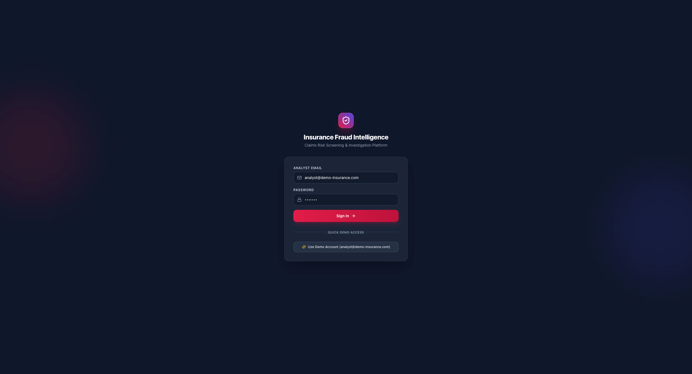
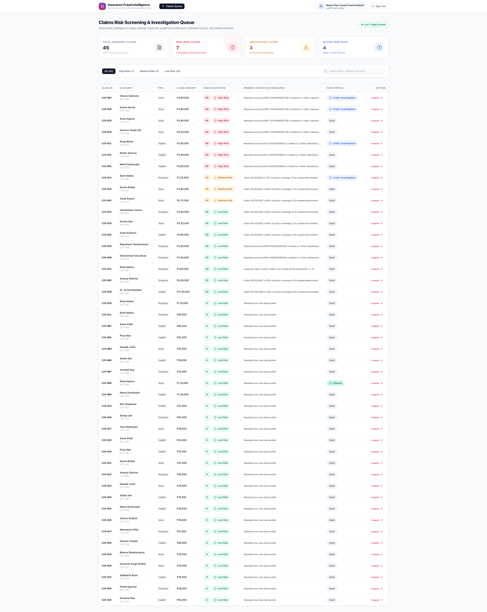
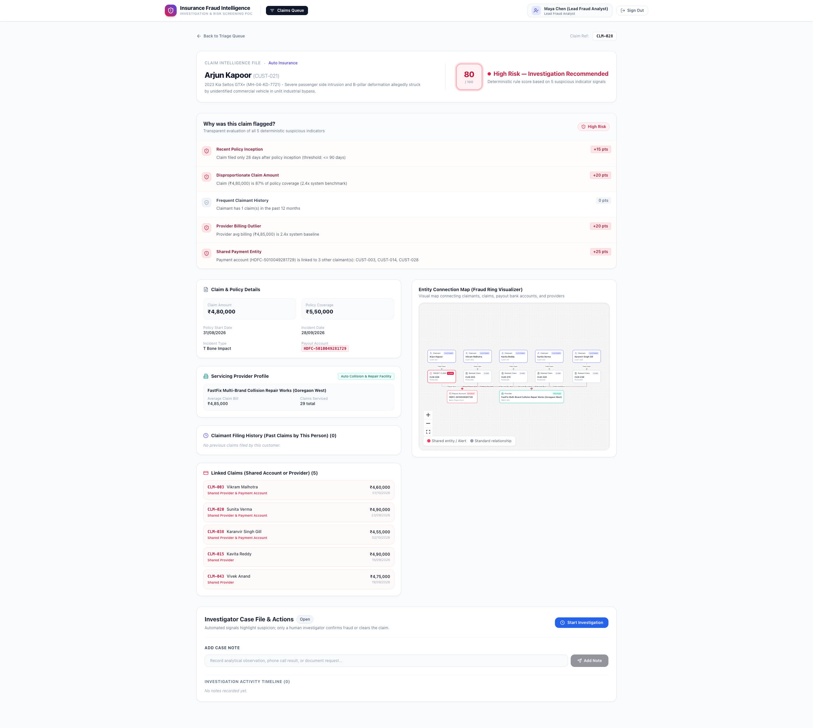
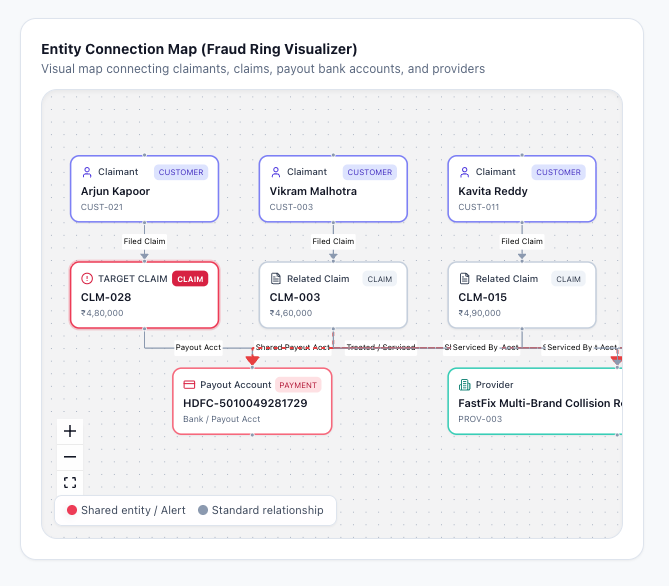

# Insurance Fraud Intelligence & Investigation Platform (POC)

A focused proof of concept demonstrating that modern insurance fraud detection must analyze **multi-entity network connections and historical filing velocity**, rather than evaluating individual claims in isolation.

> **Synthetic Demo Data Notice**: All claimant names, claim IDs, policy numbers, healthcare facilities, repair workshops, bank account identifiers, vehicle records, medical descriptions, and investigation logs in this repository are strictly synthetic demo data generated for evaluation purposes. Any resemblance to real entities or accounts is purely coincidental.

---

## Visual Platform Tour

### 1. Analyst Authentication & One-Click Demo Access


### 2. Claims Risk Screening & Triage Queue Dashboard


### 3. Claim Intelligence, Explainability & Case File


### 4. Multi-Entity Relationship Graph (Fraud Ring Visualizer)


---

## 1. Executive Summary & Core Concept

### The Problem: Claim Isolation at First Notice of Loss (FNOL)
Traditional fraud screening systems inspect claims in isolation. An adjuster evaluates a claim based solely on the documents submitted for that single incident. If a claim appears reasonable on paper (for example, a ₹4,80,000 auto collision with an itemized repair invoice), standard single-claim rules approve it.

However, **organized insurance fraud is rarely an isolated event**. Fraud syndicates coordinate across multiple policies:
- Different individuals file separate claims on different dates.
- Claim payouts route into the **same bank accounts**.
- Repairs or treatments are directed through the **same outlier repair facilities or clinics**.
- Policies are purchased shortly before staged accidents or procedures occur.

### The Solution: A 3-Dimensional Intelligence Model
This POC demonstrates a multi-dimensional screening model:
1. **Claim-Level Signals**: Does the claim amount approach the policy limit? Was the policy purchased recently?
2. **Claimant Velocity**: Has this customer filed multiple claims in the past 12 months?
3. **Cross-Entity Relationships**: Is the payout bank account shared with other claimants? Does the provider have an abnormal billing profile?

### Human-in-the-Loop Governance
Automated algorithms calculate **suspicious risk indicators and explainable scores**; **only a human investigator can mark a claim as "Confirmed Fraud" or "Cleared"**. This ensures alignment with governance, explainability, and regulatory expectations where automated systems assist rather than replace human judgment.

---

## 2. Tech Stack & Selection Rationale

| Layer | Technology | Rationale |
|---|---|---|
| **Frontend Framework** | **React 18 + Vite** | Fast development server, rapid bundle builds, and standard component-driven UI. |
| **Styling** | **Tailwind CSS** | Clean design system, responsive layouts across desktop and mobile, with zero runtime CSS overhead. |
| **Routing** | **React Router v6** | Client-side routing with protected routes and clean URL states (`/claims/:claimId`). |
| **Graph Visualization** | **React Flow (`@xyflow/react`) + Dagre** | Interactive canvas with automatic hierarchical layout for multi-entity relationship discovery. |
| **Icons & UI** | **Lucide React** | Consistent enterprise iconography. |
| **API Client** | **Axios** | Configured with `withCredentials: true` for HTTP-only cookie session management. |
| **Backend Runtime** | **Node.js + Express** | Lightweight, modular REST API structure with dedicated route controllers. |
| **Database** | **MongoDB Atlas + Mongoose** | Flexible document store with dedicated database user scoped exclusively to `insurance-fraud-poc`. |
| **Authentication** | **JWT via HTTP-Only Cookies** | Session security with `bcrypt` password hashing, `sameSite: "lax"`, and `httpOnly: true`. |
| **E2E Testing** | **Playwright** | Browser automation suite orchestrating both backend (`:3001`) and frontend (`:5173`). |

---

## 3. Engineering Decisions & Architecture

1. **Explainable Rules vs. Black-Box Machine Learning**:
   - In insurance operations, opaque ML score outputs cannot easily be audited or explained to claimants, senior leadership, or ombudsmen during a disputed claim.
   - Built a **deterministic 5-signal scoring engine** with itemized weights and natural-language evidence strings. Every score is fully transparent and auditable.

2. **False Positive Protection on Legitimate High-Value Claims**:
   - Naive systems flag any large claim as suspicious, creating friction for honest customers experiencing genuine catastrophic losses.
   - Evaluates coverage ratio and provider baselines together rather than relying on absolute dollar amount alone. For example, claim `CLM-030` (Dr. Arvind Nambiar) involves a ₹11,50,000 surgical procedure on a long-standing 5.7-year policy at an accredited hospital, correctly receiving a **Low Risk (20 pts)** score.

3. **Multi-Entity Relationship Mapping**:
   - Avoids the operational overhead of a separate graph database by querying indexed payment account and provider references in MongoDB, passing nodes and edges to `@xyflow/react` and `@dagrejs/dagre` for client-side hierarchical rendering.

4. **Dedicated Database Isolation**:
   - Connects to MongoDB Atlas using credentials scoped exclusively to `insurance-fraud-poc` with `readWrite` access, preventing any interaction with other databases on the cluster.

5. **Persistent Investigation Audit Trail**:
   - Case decisions, timeline notes, author attribution, and outcome rationales persist directly to MongoDB via `PATCH /api/investigations/:claimId`.

---

## 4. Deterministic Risk Engine & Scoring Model

The risk engine evaluates **5 deterministic signals** totaling a maximum of 100 points:

| Signal ID | Indicator Name | Weight | Trigger Condition |
|---|---|---|---|
| `recent_policy` | **Recent Policy Inception** | **+15 pts** | Claim filed within $\le 90$ days of policy start date. |
| `high_claim_amount` | **Disproportionate Claim Amount** | **+20 pts** | Claim amount $\ge 70\%$ of policy coverage **OR** $\ge 2.2\times$ system-wide provider average. |
| `repeated_claims` | **Frequent Claimant History** | **+20 pts** | Customer filed $\ge 3$ claims within the previous 12 months. |
| `provider_anomaly` | **Provider Billing Outlier** | **+20 pts** | Provider average claim exceeds $1.5\times$ system-wide provider average. |
| `shared_entity` | **Shared Payment Entity** | **+25 pts** | Payout bank account is linked to $\ge 2$ distinct claimants. |

### Risk Tiers
- **High Risk ($\ge 70$ pts)**: Investigation Recommended. Straight-through processing halted; flagged for SIU review.
- **Medium Risk ($40 - 69$ pts)**: Review Recommended. Flagged for senior desk adjuster evaluation.
- **Low Risk ($< 40$ pts)**: Standard Processing. Eligible for standard operational workflows.

---

## 5. Seeded Dataset & Key Scenarios

The database is pre-seeded with **45 claims** and **10 providers** across auto, health, and property lines:

1. **Western Corridor Staged Collision Ring (High Risk — Score: 80)**:
   - Claims `CLM-003`, `CLM-020`, `CLM-028`, and `CLM-038` share the same bank payout account (`DEMO-HDFC-5010049281729`) and all route to outlier body shop *FastFix Multi-Brand Collision Repair Works*.
   - Each claim was filed within 20–45 days of policy inception, requesting 80%–92% of the coverage limit.
2. **Sunrise Phantom Soft-Tissue Inpatient Ring (High Risk — Score: 80)**:
   - Claims `CLM-031`, `CLM-032`, and `CLM-041` share account `DEMO-ICIC-041201509921` and bill 8-day inpatient decompression packages at *Sunrise Wellness & Spine Rehabilitation Centre* (an outpatient clinic with zero licensed overnight beds).
3. **Serial Claimant Velocity (Medium Risk — Score: 40)**:
   - Claim `CLM-013` (Rohit Mehta): 4th property claim filed within 12 months on policy `POL-PROP-HOME-30419` (+20 frequent claimant, +20 high claim amount).
4. **Suspicious Relationship Indicators (Low Risk Baseline — Score: 25)**:
   - Claims `CLM-039` and `CLM-040` share a contractor payout account (`DEMO-AXIS-918020048192`). Because no other compounding fraud signals are present, each scores **25 (Low Risk)**. The shared account is flagged as a relationship indicator without prematurely triggering a high-risk alert.
5. **Legitimate High-Value Controls (Low Risk — Score: 20)**:
   - `CLM-030` (Dr. Arvind Nambiar): ₹11,50,000 emergency CABG heart surgery on a 5.7-year policy at accredited Metro General Hospital.
   - `CLM-005` (Ananya Sharma): ₹8,50,000 structural fire on a 3.5-year policy with verified municipal fire brigade report.
6. **Clean Baseline Claims (Low Risk — Score: 0)**:
   - 33 routine genuine claims (stone-chip windshield replacements, cataract procedures, dengue recovery stays, minor pipe repairs).

---

## 6. The 7 REST APIs

### Authentication Endpoints
- `POST /api/auth/login`: Authenticates analyst credentials (`analyst@demo-insurance.com` / `demo123`), issues HTTP-only JWT cookie (`token`).
- `POST /api/auth/logout`: Clears the JWT cookie and terminates the session.
- `GET /api/auth/me`: Validates session cookie and returns current analyst profile.

### Intelligence & Investigation Endpoints
- `GET /api/dashboard`: Computes risk scores across all claims, aggregates KPI metrics (`totalClaims`, `highRisk`, `mediumRisk`, `lowRisk`, `openInvestigations`), and returns the prioritized queue.
- `GET /api/claims/:claimId`: Returns complete dossier for a claim: risk breakdown, policy snapshot, servicing provider statistics, customer claim history, linked claims, and investigation records.
- `GET /api/claims/:claimId/relationships`: Generates nodes and edges for the React Flow visualizer, mapping claimants, claims, providers, and payout accounts.
- `PATCH /api/investigations/:claimId`: Updates case status (`under_investigation`, `cleared`, `confirmed_fraud`), appends timestamped investigator notes, and records outcome rationales.

---

## 7. Application Walkthrough

### 1. Login Page (`/login`)
- Dedicated analyst sign-in with a one-click **"Use Demo Account"** button for immediate evaluation.

### 2. Claims Risk Screening & Triage Queue (`/`)
- Summary KPI cards: Total Screened Claims (45), High Risk (7), Medium Risk (3), Active Case Files (4).
- Filter tabs: All (45), High Risk (7), Medium Risk (3), Low Risk (35).
- Search filter matching claim IDs, claimant names, providers, and accounts.
- Clean table displaying Claim ID, Claimant, Policy Type, Amount, Risk Evaluation (score + badge), Primary Suspicious Indicator, Case Status, and Action. Designed to fit standard desktop screens without horizontal scrollbars.

### 3. Claim Intelligence & Investigation Case File (`/claims/:claimId`)
- **Score Wheel & Badge**: Color-graded risk indicator.
- **Explainability Card**: Itemized view of all 5 deterministic signals with points and evidence.
- **Servicing Provider Profile**: Provider classification (*Auto Collision & Repair Facility*, *Multi-Specialty Hospital*, *Specialty Clinic*, *Restoration Contractor*), claim volume, and average bill.
- **Claimant Filing History**: Previous claims filed by the same policyholder within the past 12 months.
- **Linked Claims**: Claims connected via shared bank accounts or providers.
- **Entity Connection Map**: Interactive React Flow graph with animated alert edges connecting shared entities.
- **Investigator Case File**: Status controls (*Start Investigation*, *Clear Claim*, *Confirm Fraud*), case note input, and persistent chronological activity timeline.

---

## 8. Setup & Testing

### Running Locally
```bash
# 1. Install root dependencies
npm install

# 2. Start frontend (:5173) and backend (:3001) concurrently
npm run dev
```

### Seeding Demo Data
```bash
# Reset MongoDB database to default 45 claims and 10 providers
npm run seed
```

### Running Automated Playwright E2E Tests
```bash
# Run the 6-spec test suite with detailed list output:
npx playwright test --reporter=list

# Run tests with visible browser window:
npx playwright test --headed
```